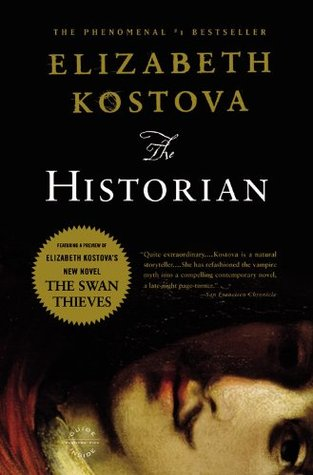

Here is a list of what I'm currently reading, what is up next, what I've read this year, and what I've read in the past.

<strong>What I'm Reading: 
 
</strong><em>The Historian</em> by Elizabeth Kostova<strong> 
</strong>

<strong>Next Up: 
</strong><i>Kindred </i>by Octavia Butler

<strong>2015 Reads (Goodreads Goal = 40 books):</strong> 
<em>The Love Affairs of Nathaniel P</em> by Adelle Waldman 
<em>Golden Son</em> by Pierce Brown 
<em>Eleanor &amp; Park</em> by Rainbow Rowell 
<em>Red Queen</em> by Victoria Aveyard 
<em>Insurgent</em> by Veronica Roth 
<em>Allegiant</em> by Veronica Roth 
<em>The Raven Boys</em> by Maggie Stiefvater 
<em>The Walled City</em> by Ryan Graudin 
<em>The Girl on the Train</em> by Paula Hawkins 
<em>Beautiful Creatures </em>by Kami Garcia &amp; Margaret Stohl 
<em>Outlander </em>by Diana Gabaldon 
<em>Strengths Finder</em> by Tom Rath 
<em>Twilight</em> by Stephenie Meyer 
<em>#Girlboss</em> by Sophia Amoruso 
<em>Leave Your Mark</em> by Aliza Licht 
<em>Leaving Atlanta</em> by Tayari Jones 
<em>Magonia</em> by Maria Dahvana Headley 
<em>City of Bones</em> by Cassandra Clare 
<em>Half-Resurection Blues</em> by Daniel José Older 
<em>The Magicians</em> by Lev Grossman  
<em>The Mime Order</em> by Samantha Shannon 
<em>Ready Player One</em> by Ernest Cline 
<em>Uprooted</em> by Naomi Novik 
<em>Shadowshaper </em>by Daniel Jose Older 
<em>The Martian</em> by Andy Weir 
<em>Cinder</em> by Marissa Meyer 
<em>The Infinite Sea</em> by Rick Yancey 
<em>You</em> by Caroline Kepnes review 
The Dream Thieves by Maggie Stiefvater 
<em>The Girl Who Fell From the Sky</em> by Heidi W. Durrow  
<em>Beautiful Darkness</em> by Kami Garcia &amp; Margaret Stohl 
<em>Falling Kingdoms</em> by Morgan Rhodes 

 

<strong>2014 Reads (Goodreads Goal = 25 books): 
</strong>2014 Favorites</a> 
<em>The Impossible Knife of Memory</em> by Laurie Halse Anderson 
<em>Reconstructing Amelia</em> by Kimberly McCreight 
<em>Divergent</em> by Veronica Roth 
<em>Harry Potter and the Sorcerer's Stone</em> by JK Rowling 
<em>Harry Potter and the Chamber of Secrets</em> by JK Rowling 
<em>Harry Potter and the Prisoner of Askaban</em> by JK Rowling 
<em>Harry Potter and the Goblet of Fire</em> by JK Rowling 
<em>Fangirl</em> by Rainbow Rowell 
<em>Harry Potter and the Order of the Phoenix</em> by JK Rowling 
<em>Harry Potter and the Half-Blood Prince</em> by JK Rowling 
<em>Harry Potter and the Deathly Hallows</em> by JK Rowling 
<em>Anna and the French Kiss</em> by Stephanie Perkins 
<em>We Were Liars</em> by E. Lockhart 
<em>Daughter of Smoke and Bone</em> by Laini Taylor 
<em>Legend</em> by Marie Lu 
<em>Days of Blood &amp; Starlight</em> by Laini Taylor 
<em>The Hunger Games</em> by Suzanne Collins 
<em>The Bone Season</em> by Samantha Shannon 
<em>Lola and the Boy Next Door</em> by Stephanie Perkins 
<em>Catching Fire</em> by Suzanne Collins 
<em>Dreams of Gods &amp; Monsters</em> by Laini Taylor 
<em>Vicious</em> by V.E. Schwab 
<em>The 5th Wave</em> by Rick Yancey 
<em>Angelfall</em> by Susan Ee 
<em>Isla and the Happily Ever After</em> by Stephanie Perkins 
<em>The Magicians</em> by Lev Grossman 
<em>Gone Girl</em> by Gillian Flynn 
<em>The Thousand Dollar Tan Line (Veronica Mars #1)</em> by Rob Thomas &amp; Jennifer Graham 
<em>Miss Peregrines Home</em> for Peculiar Children by Ransom Riggs 
<em>Anna Dressed in Blood</em> by Kendare Blake 
<em>Half Bad</em> by Sally Green 
<em>Mockingjay</em> by Suzanne Collins 
<em>Mr. Penumbra's 24-hour Book Store</em> by Robin Sloane 
<em>Red Rising</em> by Pierce Brown 
<em>Everything I've Never Told You</em> by Celeste Ng

